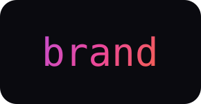

**The visual and voice identity behind `abukix`, `basecamp`, and `/root`. Voice anchors, typography, colors, and wordmark rules.**

---

## What this is

The single source of truth for the abukix brand across every artifact:

- [`/root`](https://github.com/abukix/root): the curriculum (voice anchors enforced by the `root-tutor` and `pre-publish-check` skills)
- [`basecamp`](https://github.com/abukix/basecamp): the platform (module READMEs, ARCHITECTURE, RELEASING all follow this voice)
- [`abukix`](https://github.com/abukix/abukix): the profile README
- [`learnix`](https://github.com/abukix/learnix): learning-in-public archive
- [`homelab`](https://github.com/abukix/homelab): hardware and software notes
- [`bootstrap`](https://github.com/abukix/bootstrap): the launch-sequence dev-laptop tool

Every one of those repos points here for voice and design tokens.

## Sections

| Section | Contents |
|---|---|
| [`identity.md`](identity.md) | Voice anchors, the writing discipline |
| [`typography.md`](typography.md) | JetBrains Mono and Inter Variable, how they're used |
| [`colors.md`](colors.md) | Family gradient (purple to pink to orange), palette and tokens |
| [`wordmark/`](wordmark/) | SVG wordmarks and rendering rules |

## Why a separate repo, and not part of `/root`

- **Cross-cutting.** Brand rules apply to every abukix repo, not just `/root`. Hosting them inside `/root` biases the curriculum toward being the canonical home when it isn't.
- **Different lifecycle.** Voice anchors are stable across many `/root` releases. When brand v1.0.0 lands, in `/root`'s Arc 5 Capstone period, it's an independent release, not a curriculum version bump.
- **Referenceable by name.** Every other repo can link `https://github.com/abukix/brand`, one canonical URL.

## Contributing

Voice and design are personal; contributions of substance are unlikely to be a fit. Typo fixes and factual corrections are welcome. See [`CONTRIBUTING.md`](CONTRIBUTING.md).

## License

**Documentation** (`.md` files): [Creative Commons Attribution 4.0](LICENSE). Adapt, share, credit.

**Wordmark SVG files** (`wordmark/`): personal identity, no license granted. Using the abukix wordmark to represent your own work is not permitted.
